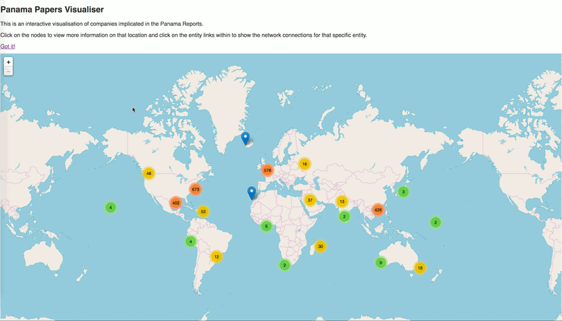

# offshoreleaks-viz

A Geospatial-Network Visualisation of the ICIJ Paradise/Panama Papers data

(Featured in the [Neo4j blog](https://neo4j.com/blog/twin4j/this-week-in-neo4j-graph-visualization-of-panama-papers-neo4j-spatial-kettle-to-neo4j-cypher-query-log-analyzer/))

## Set-up instructions

#### 1. Download the Neo4j Offshore Leaks database
Download the right Neo4j Desktop executable for your OS from: https://offshoreleaks.icij.org/pages/database

Run the executable to start the database.

#### 2. Geomapping the address nodes in the database
The address nodes in the database have no coordinate information. We’ll have to preprocess it by running a query over the database to geomap the address nodes.

(i). Append the following to the _neo4j.conf_ file to set the details of the geomapping API provider.

    apoc.spatial.geocode.provider=opencage
    apoc.spatial.geocode.opencage.key=KEY
    apoc.spatial.geocode.opencage.url=http://api.opencagedata.com/geocode/v1/json?q=PLACE&key=KEY
    apoc.spatial.geocode.opencage.reverse.url=http://api.opencagedata.com/geocode/v1/json?q=LAT+LNG&key=KEY

(ii). In the Neo4j browser, execute the following Cypher query:

      MATCH (a:Address) WITH a LIMIT 1
      CALL apoc.spatial.geocodeOnce(a.name) YIELD location
      WITH a, location.latitude AS latitude, location.longitude AS longitude,
        location.description AS description
      SET a.latitude = latitude,
          a.longitude = longitude,
          a.description = description

This will update the records with latitude and longitude features for our visualisation.

## Run Locally
1. Start the database by running the Neo4j executable. 
2. Open _index.html_.

